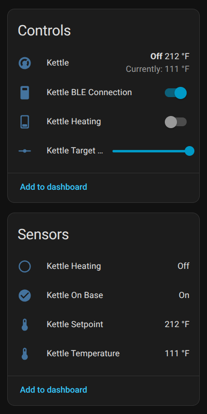

# Cosori Kettle BLE

Control your Cosori smart kettle from Home Assistant via Bluetooth Low Energy (direct BLE connection).

## Features

- **Real-time monitoring**: Temperature, setpoint, on-base status, heating state
- **Remote control**: Start/stop heating, adjust target temperature (104-212°F)
- **Climate entity**: Native thermostat card with preset modes (Boil, Green Tea, Oolong, Coffee)
- **Automation-ready**: Full Home Assistant integration
- **Automatic protocol detection**: Supports V0 and V1 firmware versions

## Hardware Compatibility

- **Cosori Electric Gooseneck Kettle** with BLE: https://www.amazon.com/COSORI-Electric-Gooseneck-Variable-Stainless/dp/B07T1CH2HH

**IMPORTANT:** The kettle only supports ONE BLE connection at a time. Disconnect from the official app or other devices before connecting.

---

# Home Assistant Integration

## Installation

### HACS (Recommended)

1. Add this repository to HACS as a custom repository
2. Install "Cosori Kettle BLE" from HACS
3. Restart Home Assistant
4. Go to Settings > Devices & Services > Add Integration
5. Search for "Cosori Kettle BLE"

### Manual Installation

1. Copy `custom_components/cosori_kettle_ble` to your Home Assistant `custom_components` folder
2. Restart Home Assistant
3. Go to Settings > Devices & Services > Add Integration
4. Search for "Cosori Kettle BLE"

## Configuration

The integration supports automatic Bluetooth discovery. Your kettle must be:
- Powered on and on its base
- Within Bluetooth range
- **NOT connected to another device** (disconnect from official app first)

### Capturing Registration Key from Mobile App

If you've already paired your kettle with the official Cosori mobile app, you can extract the registration key by capturing Bluetooth traffic:

#### iOS/macOS
Use PacketLogger via Apple's Bluetooth debugging profile:
- Follow the guide at: https://www.bluetooth.com/blog/a-new-way-to-debug-iosbluetooth-applications/
- Open the Cosori app and connect to your kettle
- Look for three consecutive packets sent to the kettle

#### Android
Use Android's built-in Bluetooth HCI snoop log:
- Guide: https://sps-support.honeywell.com/s/article/How-to-capture-Bluetooth-traffic-from-and-to-an-Android-Device
- Enable Bluetooth HCI snoop log in Developer Options
- Open the Cosori app and connect to your kettle
- Retrieve the btsnoop_hci.log file

#### Extracting the Registration Key

When you open the app, it sends three consecutive packets to the kettle. Look for:
1. **First packet** (exactly 20 bytes): `a5 XX:XX:XX:XX:XX 0181d100 YY:YY:YY:YY:YY:YY:YY:YY:YY:YY`
2. **Second packet** (exactly 20 bytes): Full payload is needed
3. **Third packet** (exactly 2 bytes): Final bytes needed

The registration key is formed by:
- Taking the last 10 bytes from the first packet (after the `0181d100` command bytes)
- Concatenating with all 20 bytes from the second packet
- Concatenating with all 2 bytes from the third packet
- These 32 bytes are ASCII-encoded hex characters representing the 16-byte registration key

The Home Assistant config flow includes a helper to parse these packets automatically. Simply paste the three raw packets into the config UI.

---

# Finding Your Kettle's MAC Address

**IMPORTANT:** The kettle will only appear in BLE scans if it's NOT already connected to another device (official app or Home Assistant integration). Disconnect from other devices first.

### Using `bluetoothctl` (Linux)

```bash
sudo bluetoothctl
scan on
# Look for your kettle (usually shows as "Cosori" or similar)
# Note the MAC address (e.g., C4:A9:B8:73:AB:29)
scan off
exit
```

### Using BLE Scanner App

- **iOS**: "BLE Scanner" or "LightBlue"
- **Android**: "nRF Connect" or "BLE Scanner"

### Using Python Script

```bash
./scan.py
```

---

# Climate Entity & Thermostat Card

The integration automatically creates a climate entity in Home Assistant, allowing you to use the native thermostat card with its semi-circle temperature slider.



### Provided Entities

- **Climate entity** - Off/Heat mode with temperature control and preset modes
- **Sensors** - Temperature, Setpoint, On Base status, Heating status
- **Switches** - Heating control
- **Number slider** - Target temperature adjustment (104-212°F)

### Using the Thermostat Card

Add to your Lovelace dashboard:

```yaml
type: thermostat
entity: climate.cosori_kettle
```

The thermostat card provides:
- **Semi-circle temperature slider** (40-100°C / 104-212°F)
- **Current temperature** display
- **Mode control** (OFF / HEAT)
- **Preset modes** (Boil, Green Tea, Oolong, Coffee)
- **Action indicator** (IDLE / HEATING)

### How It Works

- **OFF mode**: Kettle is idle, not heating
- **HEAT mode**: Kettle will heat to target temperature
- **Preset modes**:
  - Boil: 212°F
  - Green Tea: 180°F
  - Oolong: 195°F
  - Coffee: 205°F
- **Temperature slider**: Adjust custom temperature (40-100°C / 104-212°F)
- **Current temperature**: Shows actual water temperature
- **Action**: Shows HEATING when actively warming, IDLE otherwise

**Note:** Home Assistant displays temperatures in your preferred unit (Celsius or Fahrenheit). The kettle natively uses Fahrenheit, and all conversions are handled automatically.

---

# Usage Examples

## Starting the Kettle

**Using Climate Entity (Recommended):**
```yaml
service: climate.set_preset_mode
target:
  entity_id: climate.kettle
data:
  preset_mode: boil  # or green_tea, oolong, coffee
```

**Using Individual Entities:**
1. Set target temperature:
   ```yaml
   service: number.set_value
   target:
     entity_id: number.kettle_target_temperature
   data:
     value: 180
   ```

2. Turn on heating:
   ```yaml
   service: switch.turn_on
   target:
     entity_id: switch.kettle_heating
   ```

## Stopping the Kettle

```yaml
service: climate.set_hvac_mode
target:
  entity_id: climate.kettle
data:
  hvac_mode: "off"
```

## Home Assistant Automations

### Morning Kettle Automation

```yaml
automation:
  - alias: "Morning Kettle"
    trigger:
      - platform: time
        at: "07:00:00"
    condition:
      - condition: state
        entity_id: binary_sensor.kettle_on_base
        state: "on"
    action:
      - service: climate.set_preset_mode
        target:
          entity_id: climate.kettle
        data:
          preset_mode: coffee
```

### Kettle Ready Notification

**Note:** The kettle holds temperature when it reaches setpoint, so heating doesn't turn off. Use temperature threshold instead:

```yaml
automation:
  - alias: "Kettle Ready"
    trigger:
      - platform: numeric_state
        entity_id: sensor.kettle_temperature
        above: 205  # Trigger a few degrees before setpoint
    condition:
      - condition: state
        entity_id: binary_sensor.kettle_heating
        state: "on"
    action:
      - service: notify.mobile_app
        data:
          title: "Kettle Ready"
          message: "Your water is hot! ☕"
```

---

# Protocol Information

This component implements the Cosori kettle BLE protocol. The protocol version (V0/V1) is automatically detected from the kettle's firmware version.

See [PROTOCOL.md](PROTOCOL.md) for complete details.

---

# Troubleshooting

## Kettle Not Connecting / Not Found

1. **Check for active connections**: The kettle only supports ONE BLE connection at a time. Disconnect from the official app or any other integration first
2. **Check MAC address**: Ensure it matches your kettle
3. **Check distance**: Bluetooth adapter should be within ~10m of kettle
4. **Check kettle**: Ensure it's on the base and powered
5. **Check logs**: Enable debug logging
6. **Restart**: Power cycle the kettle and/or restart Home Assistant

## Kettle Shows "Unavailable"

- Check Bluetooth adapter status in Home Assistant
- Verify Bluetooth adapter is online
- Restart Home Assistant

## Commands Not Working

- Ensure kettle is on base (`binary_sensor.kettle_on_base` should be ON)
- Check connection status
- Enable debug logging to see protocol packets

## Temperature Doesn't Reach Exact Setpoint

The kettle may report temperatures 1-3°F below the setpoint when holding temperature. This is normal behavior:

- The kettle cycles heating to maintain temperature
- Temperature readings may fluctuate between 209-212°F when set to 212°F
- Use a threshold automation (e.g., `above: 205`) instead of exact temperature matching

**For accurate temperature monitoring**, use the dedicated `sensor.kettle_temperature` entity in your automations rather than the climate entity's current temperature.

## Using Official Mobile App

To use the official Cosori mobile app (which requires exclusive BLE access):

Remove the integration temporarily, use the app, then re-add the integration

---

# Debug Logging

**Home Assistant:**
```yaml
logger:
  default: info
  logs:
    custom_components.cosori_kettle_ble: debug
```

---

# Development

## Python Library

A standalone Python library is included at `custom_components/cosori_kettle_ble/cosori_kettle/` for controlling the kettle outside of Home Assistant.

See [LIBRARY.md](LIBRARY.md) for library documentation and [custom_components/cosori_kettle_ble/cosori_kettle/README.md](custom_components/cosori_kettle_ble/cosori_kettle/README.md) for API details.

## Testing

```bash
# Run library tests
uv run --extra test pytest tests/library/ -v

# Run HA component tests
uv run --extra test pytest tests/ha_component/ -v
```

## Examples

Interactive examples in `examples/`:

```bash
# Interactive control
python examples/interactive.py [MAC_ADDRESS]

# Simple boil example
python examples/simple.py
```

---

# Credits

- Protocol reverse-engineered using Wireshark and Python/Bleak

## License

MIT License - see LICENSE file for details

## Contributing

Contributions welcome! Please open an issue or PR on GitHub.

## Disclaimer

This is an unofficial third-party component. Use at your own risk. The author is not affiliated with Cosori.
